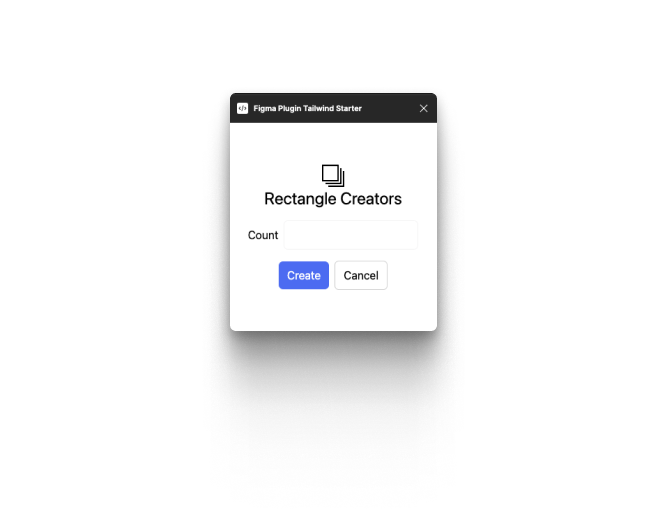
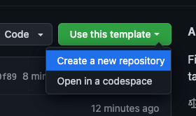

# Figma Plugins Tailwind Starter

> The react + tailwind starter for developing plugins and widgets for Figma and FigJam



### Pre-requisites

- [bun](https://bun.sh/) – v1

### Use the template



Click `Use this template` button, or clone it in your local machine

```
$ git clone https://github.com/sonnylazuardi/figma-plugins-tailwind-starter
$ cd figma-plugins-tailwind-starter
$ bun install
```

### Developing and Building

To develop the Figma Plugin project:

```
$ bun dev
```

To build the entire Figma Plugin project:

```
$ bun run build
```
